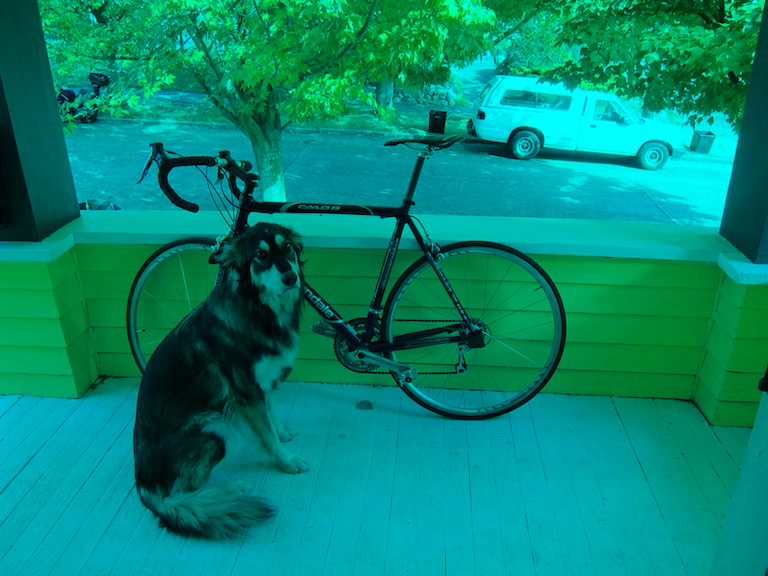
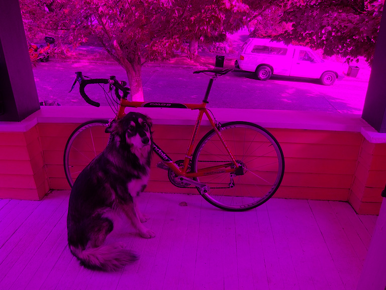
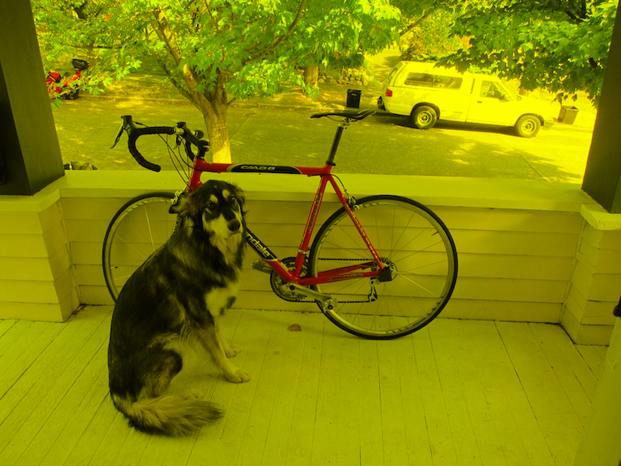
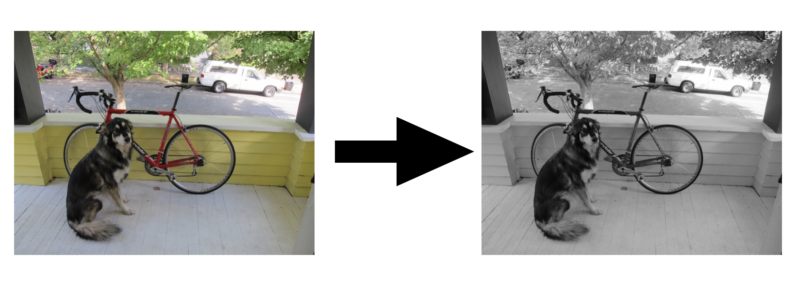
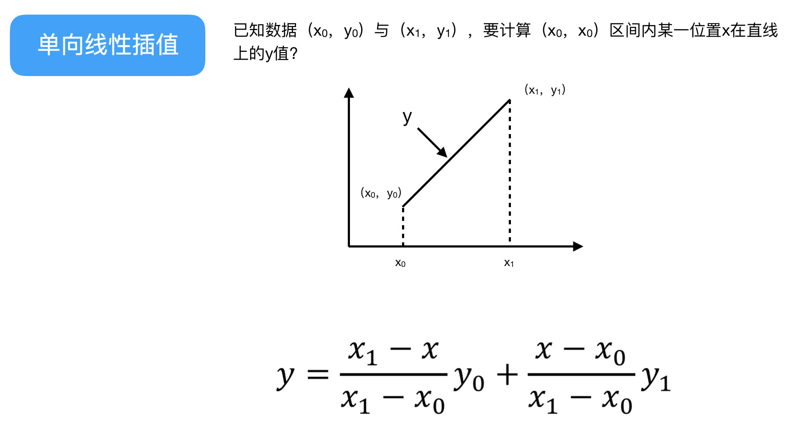

 在[上一小节](https://github.com/YunYang1994/CV-From-Scratch/tree/master/001-stb_image)里我们利用`stb_image`对图片进行了读写操作，下面将在此基础上对图片进行一些简单的基本操作。<br>
## get_pixel
文件`./src/image_basics.c`的`float get_pixel`函数可以获得图片的某个像素值，代码如下：

```c
float get_pixel(image im, int x, int y, int c)
{
    if(x >= im.w) x = im.w - 1;
    if(y >= im.h) y = im.h - 1;
    if(x < 0) x = 0;
    if(y < 0) y = 0;
    assert(c >= 0 && c < im.c);
    return im.data[x + im.w * y + im.w * im.h * c];
}

```
 代码运行:
 
```bashrc
$ make
$ ./yyimg get_pixel ../data/dog.jpg
```

## set_pixel
文件`./src/image_basics.c`的`void get_pixel`函数可以改变图片的某个像素值，代码如下：

```c
void set_pixel(image im, int x, int y, int c, float v)
{
    assert(c >= 0 && c < im.c);
    if(x >= 0 && x < im.w && y >= 0 && y <= im.h){
        im.data[x + im.w * y + im.w * im.h * c] = v;
    }
}

```

例如想把图片的红色通道去除掉，那么就可以将该颜色通道里的每个像素值都设置为`0.`，代码如下：

```
for(int i=0; i<im.w; i++){
    for(int j=0; j<im.h; j++){
        set_pixel(im, i, j, 0, 0.); // 红色通道的索引为0
    }
}
```

|原始图片|去掉红色通道|去掉绿色通道|去掉蓝色通道|
|---|---|---|:---:|
|||||
 代码运行:
 
```bashrc
$ make
$ ./yyimg set_pixel ../data/dog.jpg
```

## rgb2gray
文件`./src/image_basics.c`的`void rgb2gray`函数可以将彩色图像转化为灰度图像。灰度是描述灰度图像内容的最直接的视觉特征。它指黑白图像中点的颜色深度，范围一般从0到255，白色为255，黑色为0，故黑白图像也称灰度图像。


当彩色图像转换为灰度图像时，需要计算图像中每个像素有效灰度值，其计算公式为：`Y = 0.299 R + 0.587 G + 0.114 B`

```c
image rgb2gray(image im){
    assert(im.c == 3);
    image gray = make_image(im.w, im.h, 1);
    for(int i=0; i<im.w; i++){
        for(int j=0; j<im.h; j++){
            int idx = i + im.w * j;
            // Y = 0.299 R + 0.587 G + 0.114 B
            gray.data[idx] = 0.299 * im.data[idx] +
                0.587 * im.data[idx + im.w*im.h*1] + 0.114 * im.data[ idx + im.w*im.h*2];
        }
    }

    return gray;
}
```

 代码运行:
 
```bashrc
$ make
$ ./yyimg rgb2gray ../data/dog.jpg
```

## thresh_binary
图像的二值化，就是将图像上的像素点的灰度值设置为0或255，也就是将整个图像呈现出明显的只有黑和白的视觉效果。<br>

```c
image thresh_binary(image im, float thresh){
    assert(im.c == 1);
    image binary = make_image(im.w, im.h, 1);
    for(int i=0; i<im.w; i++){
        for(int j=0; j<im.h; j++){
            int idx = i + im.w*j;
            if(im.data[idx] > thresh){
                binary.data[idx] = 1.; // 每个像素已经scale到0-1之间, 因此最大值为 1.
            }else{
                binary.data[idx] = 0.; // 最小值为 0.
            }
        }
    }
    return binary;
}
```

 代码运行:

```bashrc
$ make
$ ./yyimg thresh_binary ../data/dog.jpg
```
## bilinear_resize

`bilinear_resize`，又称为双线性内插。在数学上，双线性插值是有两个变量的插值函数的线性插值扩展，其核心思想是在两个方向分别进行一次线性插值。在介绍双向插值之前，先来了解单向插值：


上面比较好理解吧，仔细看就是用x和x0，x1的距离作为一个权重，用于y0和y1的加权。双线性插值本质上就是在两个方向上做线性插值,基本思想和这个一样的。


```c
float bilinear_interpolate(image im, float x, float y, int c)
{
    int lx = (int) floor(x);
    int ly = (int) floor(y);

    float Q11 = get_pixel(im, lx, ly, c);       // Q11的坐标为[lx, ly]，    得到它像素
    float Q12 = get_pixel(im, lx, ly+1, c);     // Q12的坐标为[lx, ly+1]，  得到它像素
    float Q21 = get_pixel(im, lx+1, ly, c);     // Q21的坐标为[lx+1, ly]，  得到它像素
    float Q22 = get_pixel(im, lx+1, ly+1, c);   // Q22的坐标为[lx+1, ly+1]，得到它像素

    float R1  = (x - lx)*Q21 + (lx+1-x)*Q11;    // R1 的坐标为[x, ly],   插值得到它像素
    float R2  = (x - lx)*Q22 + (lx+1-x)*Q12;    // R2 的坐标为[x, ly+1], 插值得到它像素

    float P  = (y - ly)*R2 + (ly+1-y)*R1;       // P 的坐标为[x, y], 插值得到它像素
    return P;
}
```

代码运行

```bashrc
$ make
$ ./yyimg bilinear_resize ../data/dog.jpg // 将图片resize成 416 X 416 大小
```

## nn_resize

最简单的图像缩放算法就是最近邻插值。顾名思义，就是将目标图像各点的像素值设为源图像中与其最近的点。假设源图像的宽度和高度分别为`w`0和`h0`, 缩放后的目标图像的宽度和高度分别为`w1`和`h1`, 那么比例就是`float fw = float(w0)/w1; float fh = float(h0)/h1`; 对于目标图像中的`(x,y)`点坐标对应着源图像中的`(x0, y0)`点。其中：`x0 = int(x*fw), y0 = int(y*fh)`。

代码示例：

```c
float nn_interpolate(image im, float x, float y, int c)
{
    int lx = (int) round(x);
    int ly = (int) round(y);
    float P = get_pixel(im, lx, ly, c);
    return P;
}
```
代码运行:

```
$ ./yyimg nn_resize ../data/dog.jpg
```


