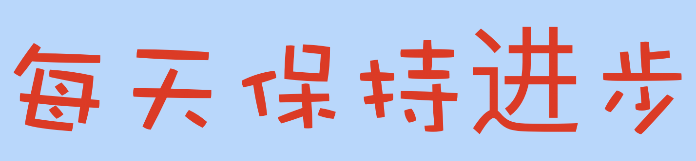

### Python与数据结构
--------------------
#### 1. [什么是线性表](https://github.com/YunYang1994/CodeFun/tree/master/001-stb_image#stb_image)
#### 2. [学习栈和队列](https://github.com/YunYang1994/CodeFun/tree/master/002-image_basics#rgb2gray)
#### 3. [递归到底是什么](https://github.com/YunYang1994/CodeFun/tree/master/002-image_basics#thresh_binary)
#### 4. [排序和搜索算法](https://github.com/YunYang1994/CodeFun/tree/master/002-image_basics#bilinear_resize)

### 图像处理算法
--------------------
#### 1. [利用stb头文件读写图片](https://github.com/YunYang1994/CodeFun/tree/master/001-stb_image#stb_image)
#### 2. [彩色图像转化成灰度图像](https://github.com/YunYang1994/CodeFun/tree/master/002-image_basics#rgb2gray)
#### 3. [图像二值化](https://github.com/YunYang1994/CodeFun/tree/master/002-image_basics#thresh_binary)
#### 4. [线性插值和最近邻插值](https://github.com/YunYang1994/CodeFun/tree/master/002-image_basics#bilinear_resize)

### 深度学习框架
--------------------
#### 1. [将pytorch模型转换成tensorflow](https://github.com/YunYang1994/CodeFun/tree/master/003-pytorch2tf)

### CUDA 编程
--------------------
#### 1. [了解CUDA编程](https://github.com/YunYang1994/cuda-tutorial/blob/master/004-cuda_tutorial/chapter01)
#### 2. [矩阵求和运算](https://github.com/YunYang1994/cuda-tutorial/blob/master/004-cuda_tutorial/chapter02)
